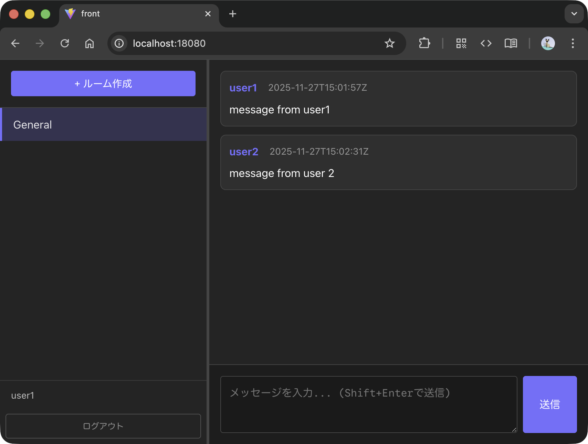

# Toy Small Chat

<p align="center">

</p>

## 構成

### api

- バックエンド REST API
- Vertical Slice Architecture の検証 PoC
    - マイクロサービス化を見据えた、関心領域で分割されたパッケージ構成
- Future Work
    - テストコードの拡充

### front

- Web フロントエンド (Vite + React) 
- Code with Claude Code

## 実行

api/.env ファイルの準備

```
cp ./api/.env.example ./api/.env
```

コンテナの立ち上げ

```
docker compose up
```

- Application
    - WebFrontend: http://localhost:18080
    - Backend API: http://localhost:18081
- Observability
    - Grafana: http://localhost:13000
