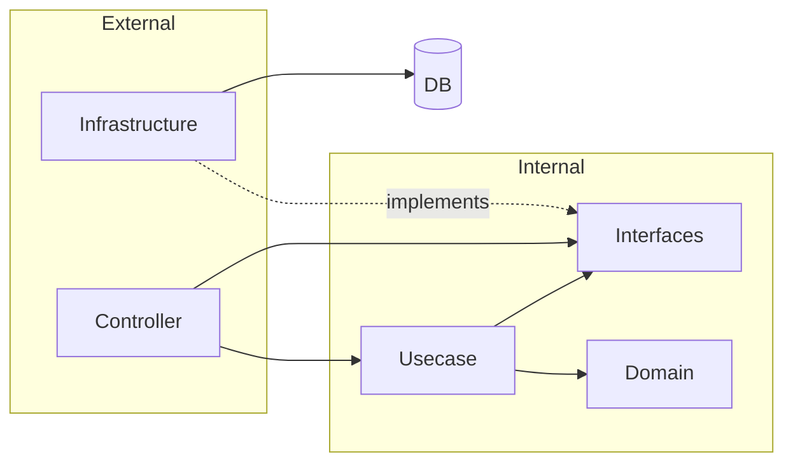

# API

## Architecture

Vertical Slice Architecture として、まず関心領域ごと account, message, room でスライスされる。各スライスの内部は Clean Architecture をベースにしたパッケージ構成をとる。



## Directory Structure

```
api/
├── main.go                 # エントリーポイント
├── internal/
│   ├── config/             # 環境変数の読み込み
│   ├── di/                 # 依存性注入コンテナ
│   ├── db/                 # sqlc生成コード
│   ├── domain/             # ドメインモデル・値オブジェクト
│   ├── instrument/         # OpenTelemetry設定
│   ├── server/             # HTTPサーバー・ルーティング
│   │   ├── routes/
│   │   └── middlewares/
│   └── applications/       # アプリケーションパッケージ
│       └── {account,message,room}/
│           ├── controller/                            # リクエスト/レスポンス変換
│           ├── usecase/                               # ビジネスロジック
│           │   └── {repository,queryprocessor}/       # インターフェース定義
│           └── infrastructure/
│               └── {repository,queryprocessor}impl/   # インターフェース実装
```
